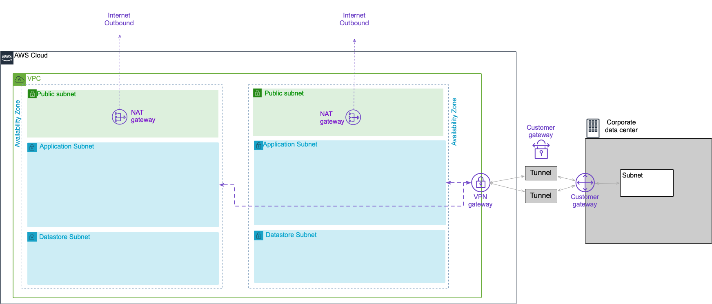

# aws-site-to-site-vpn
aws site-to-site vpn



1. Build a sample VPC.

```shell script
# shell variables
$ ProjectName=vpn
$ SubSystemName=vpc
$ EnvironmentName=test

# create sample vpc
$ aws cloudformation create-stack \
--stack-name ${ProjectName}-${SubSystemName}-${EnvironmentName} \
--region ap-northeast-1 \
--template-body file://vpc.yml \
--capabilities CAPABILITY_NAMED_IAM
```

2. create vpn

```shell script
# shell variables
$ SubSystemName=vpn

# create vpn
$ aws cloudformation create-stack \
--stack-name ${ProjectName}-${SubSystemName}-${EnvironmentName} \
--region ap-northeast-1 \
--template-body file://vpn.yml \
--capabilities CAPABILITY_NAMED_IAM

```

3. Download VPN setting information from VPC management console.  
[VPC management console]-> [Site-to-site VPN connection]-> [Download Configuration]

Set the following setting information in the connection destination VPN.

```text
IPsec Tunnel #1
  - Pre-Shared Key           : xxxxxxxxxxxxxxxxxx
  Outside IP Addresses:
    - Virtual Private Gateway	        : xxx.xxx.xxx.xxx

IPsec Tunnel #2
  - Pre-Shared Key           : xxxxxxxxxxxxxxxxxx
  Outside IP Addresses:
    - Virtual Private Gateway	        : xxx.xxx.xxx.xxx
```

Then check the connection by pinging.
